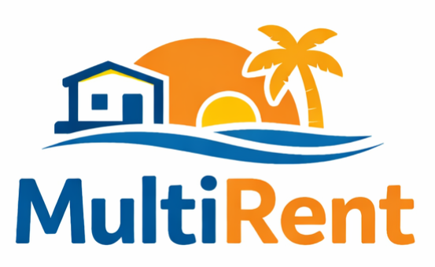

<p align="center">
	
</p>

# WP MultiRent

WP MultiRent contains the **Multi Apartment Rental** WordPress theme and the **MultiRent Companion** plugin.

MultiRent is built for apartment, room, villa, and multi-unit rental websites. It helps site owners manage listings, images, amenities, maps, QR codes, local information, menus, colors, and contact details from the WordPress dashboard without editing theme files.

The theme outputs UTF-8 markup through WordPress, uses the active WordPress database charset, and supports Croatian characters such as `č`, `ć`, `ž`, `š`, and `đ` in titles, menus, settings, and rental content.

- Promotional site: [https://multirent.online](https://multirent.online)
- Demo site: [https://demo.multirent.online](https://demo.multirent.online)

## What Is Included

- `MultiRent/`: WordPress theme source.
- `multirent-companion/`: companion plugin for setup screens, rental units, amenities, menus, colors, starter content, 30+ CC0 demo images, generated demo QR-style images, and in-admin help.
- `local-wordpress/`: Docker-based local WordPress setup for testing the theme and plugin from this repository.
- `release-assets/`: latest packaged ZIP files for WordPress upload.

## Start Locally

Install Docker Desktop, then start the local WordPress site from this repository:

```powershell
Set-Location .\local-wordpress
docker compose up -d
```

Open the local site at:

- Site: [http://localhost:8082](http://localhost:8082)
- WordPress admin: [http://localhost:8082/wp-admin](http://localhost:8082/wp-admin)

The Docker setup mounts the repository source folders directly into WordPress, so changes in `MultiRent/` and `multirent-companion/` are visible in the local site.

For a full beginner workflow, including Docker Desktop, local WordPress, backups, and live restore, read [Beginner Docker, backup, and live restore guide](BEGINNER_DOCKER_MIGRATION_GUIDE.md).

## Install The Theme Files

Use the packaged ZIP files from `release-assets/` or the latest GitHub release.

1. In WordPress admin, open **Appearance > Themes > Add New > Upload Theme**.
2. Upload and activate `multirent-theme-upload-0.1.32.zip`.
3. Open **Plugins > Add New > Upload Plugin**.
4. Upload and activate `multirent-companion-plugin-upload-0.1.32.zip`.
5. Open **MultiRent Setup** from the WordPress left admin menu.
6. On a fresh site, use **Create Starter Pages, Menu, Amenities, and Rental Units**. This creates the Apartments page and four starter rental units.
7. Rename, add, or edit rental units under **MultiRent Setup > Rental Units**.

If you received `multirent-complete-package-extract-first-0.1.32.zip`, extract it first. It contains the separate theme and plugin ZIP files that must be uploaded individually.

Do not upload the complete package ZIP or GitHub's automatic source-code ZIP as a theme. WordPress expects the theme upload ZIP to contain `MultiRent/style.css`.

## Documentation

- [MultiRent Companion setup README](multirent-companion/README.md): full no-code setup workflow and admin-screen reference.
- [Multi Apartment Rental theme README](MultiRent/README.md): theme templates, header behavior, colors, apartment pages, and package notes.
- [Local WordPress Docker setup](local-wordpress/README.md): local commands, seeding, stopping, and volume cleanup.
- [Project notes](docs/PROJECT_NOTES.md): demo content, update safety, privacy boundary, release notes, warranty, and support notes.
- [Release policy](RELEASE_POLICY.md): packaging and GitHub release retention.

The companion README is also visible inside WordPress after installation under **MultiRent Setup > Help / README**.

## License

MultiRent is free for private, non-commercial use with attribution. Commercial use requires prior written permission.

See [LICENSE.md](LICENSE.md) for the full private-use license notice.
