# MultiRent Complete User Guide

This guide explains how to build a WordPress rental website with **Multi Apartment Rental** and **MultiRent Companion** from the first local setup through public pages, apartment listings, contact pages, local information, menus, buttons, amenities, styling, backup, and deployment.

Use this as the primary end-user guide. The shorter README files only point to this workflow and package information.

Each major process below includes an embedded Mermaid process diagram directly inside the instructions. The same workflows are also available as Draw.io files for graphical editing and export:

- [MultiRent process diagrams](diagrams/MULTIRENT_PROCESS_DIAGRAMS.drawio)
- [MultiRent overview workflow](diagrams/MULTIRENT_WORKFLOW.drawio)

## Who This Guide Is For

This guide is for a property owner, site manager, or builder who wants to create a rental website without editing PHP, CSS, or theme files.

You can use MultiRent for:

- apartments
- rooms
- villas
- houses
- multi-unit holiday rentals
- small rental agencies

## Main Concepts

MultiRent has two parts:

- **Multi Apartment Rental theme**: controls the public website layout and templates.
- **MultiRent Companion plugin**: adds the WordPress admin screens for setup, rental units, amenities, pages, menus, colors, fonts, maps, QR codes, and demo content.

Important WordPress admin areas:

- **MultiRent Setup > Website Setup**: site identity, homepage sections, hero text, global font, colors, top menu builder, starter content.
- **MultiRent Setup > Pages & Buttons**: apartment pages, contact pages, hero buttons, top-menu checkboxes for page slots.
- **MultiRent Setup > Rental Units**: apartments/rooms/villas shown in listings.
- **MultiRent Setup > Local Page**: local guide page content.
- **MultiRent Setup > Amenities**: icons/tags used on rental units.
- **MultiRent Setup > Help / README**: in-admin help.

## Recommended Build Order

**Process diagram:** overall order for building a MultiRent site.

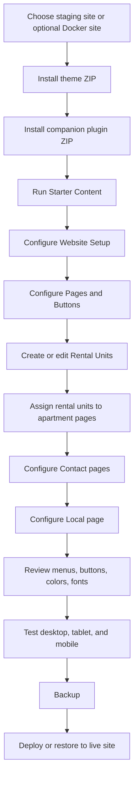

## 1. Start With A Safe Working Site

Build on a staging WordPress site, or use Docker if you want a private WordPress site on your own computer before touching the live site. For the Docker option, follow the [Beginner Docker, backup, and live restore guide](../BEGINNER_DOCKER_MIGRATION_GUIDE.md).

Install MultiRent from the ZIP files on the [latest GitHub release](https://github.com/marinfrankovic/WP_MultiRent/releases/latest):

1. Download the theme upload ZIP and companion plugin upload ZIP from the [latest GitHub release](https://github.com/marinfrankovic/WP_MultiRent/releases/latest).
2. Upload the theme ZIP in **Appearance > Themes > Add New > Upload Theme**.
3. Upload the companion plugin ZIP in **Plugins > Add New > Upload Plugin**.
4. Activate both.
5. Open **MultiRent Setup**.

**Process diagram:** safe local or staging setup before editing the site.

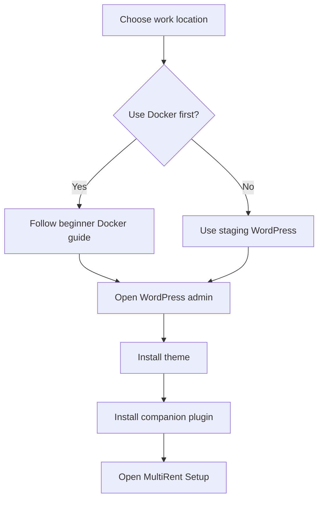

## 2. Create Starter Content

Use Starter Content on a fresh site to create the first working structure.

In WordPress admin:

1. Open **MultiRent Setup > Website Setup**.
2. Find **Starter Content**.
3. Confirm the checkbox.
4. Click **Create Starter Pages, Menu, Amenities, and Rental Units**.

Starter Content creates or configures:

- Home page
- Apartments page
- Contact page
- Local page
- primary top menu
- default amenities
- four starter rental units
- Apartment Page 1
- Contact Page 1
- initial hero buttons for Apartment Page 1 and Contact Page 1

Starter Content is additive. It creates missing content and applies default assignments. It is meant for new sites or controlled setup work, not for resetting a live production site without review.

**Process diagram:** starter content creation and first page assignments.

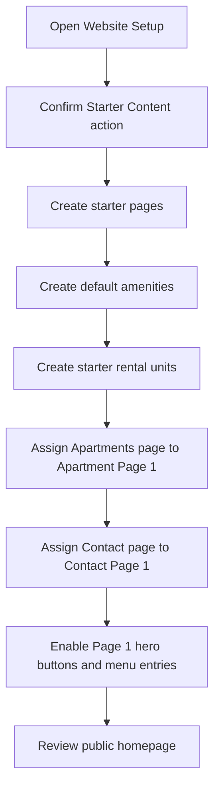

## 3. Configure Website Setup

Use this screen for the mandatory homepage and site-wide brand settings.

### Property Name

Shown in the site header and key theme areas. It overrides the normal WordPress Site Title in public theme output.

Example:

```text
Villa Makar
Brajkovic Apartments
Sea View Holiday Homes
```

### Property Tagline

Short line under the property name in the header. It overrides the normal WordPress tagline in theme output.

Example:

```text
Apartments near the beach
Family villas and sea view stays
```

### Homepage Section Visibility

Controls which homepage sections appear:

- Hero section
- Intro section
- Stats strip
- Apartment cards
- Reviews section
- admin-only SEO reminder
- admin-only backup reminder

Hidden sections keep their saved settings so you can turn them back on later.

### Hero Eyebrow

Small uppercase label shown above the hero title. Use it for a short category or tagline.

```text
Multi-unit rental website
Seaside apartments
Holiday homes in Dalmatia
```

Leave it empty to hide the label entirely.

### Hero Title

Large homepage headline.

Keep it short. Good examples:

```text
Apartments ready to explore
Seaside stays for every guest
Family apartments in Zivogosce
```

### Hero Text

Short paragraph under the hero title. Use it to explain the offer in one or two sentences.

### Hero Title Size

Optional fixed hero headline size in **centimeters**.

Leave empty for the responsive default. Use a value only when the default hero title feels too small or too large for a specific brand/site.

Suggested range:

```text
1.0 to 3.0 cm
```

### Hero Image

Large background image for the homepage hero. Use a real property/place image, not a generic graphic.

### Intro Section

Use Intro Eyebrow, Intro Title, and Intro Text to explain the property or rental business below the hero.

### Stats Lines

One line per fact, using this format:

```text
value | label
```

Example:

```text
4 | Apartments
200 m | Beach distance
24/7 | Self-managed content
```

### Reviews Shortcode

Paste a shortcode from a reviews plugin. Enable the Reviews section checkbox to show it.

### Top Menu Builder

Manual header links, one per line:

```text
Home | /
Apartments | /apartments/
Local | /local/
Contact | /contact/
```

Use this for custom menu order and extra links. Apartment/contact page slots can also add themselves from **Pages & Buttons** when **Show in top menu** is checked. Duplicate URLs are skipped.

### Color Scheme And Custom Colors

Choose a preset palette or enable custom colors. Custom colors override the preset.

**Process diagram:** website setup fields and where they affect the public site.

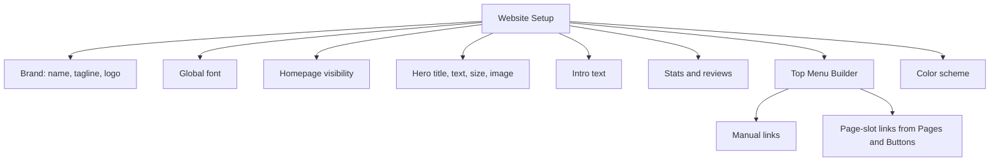

## 4. Create Apartment Page Or Pages

Apartment pages are overview/listing pages. They show rental units assigned to that page slot.

Open **MultiRent Setup > Pages & Buttons > Apartment Pages**.

You can configure up to three Apartment pages.

### Enable This Apartment Page

Makes this slot available publicly. If disabled, it is not used for templates, hero buttons, or menu inclusion.

### Show In Top Menu

Adds the selected page to the generated/header menu. If the same page URL is already listed in Top Menu Builder, it is not duplicated.

### WordPress Page

Choose the WordPress page this slot controls.

For a normal site:

- Apartment Page 1 = main Apartments page
- Apartment Page 2 = optional second category/landing page
- Apartment Page 3 = optional third category/landing page

### Apartment Template

Choose how rental units appear on the page.

Available templates:

- **Apartments - Grid**: standard card grid.
- **Apartments - Featured Guide**: intro/guide layout plus apartment cards.
- **Apartments - Compact List**: tighter list for many units.

### Assign Rental Units To Apartment Pages

Apartment pages only show rental units assigned to them.

To assign units:

1. Open **MultiRent Setup > Rental Units**.
2. Edit a rental unit.
3. In the right sidebar, open **Apartment Page Assignment**.
4. Check one or more apartment pages.
5. Update the rental unit.

If a rental unit has no assignment, it remains visible on Apartment Page 1 by default so upgrades do not hide content.

**Process diagram:** apartment page setup and rental-unit assignment.

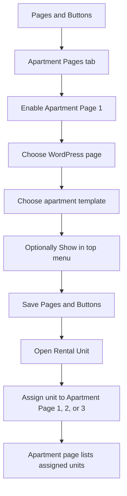

## 5. Create And Edit Rental Units

Rental Units are the apartment/room/villa listings shown on apartment pages.

Open **MultiRent Setup > Rental Units**.

Click **Add New** or edit an existing unit.

### Title

Public name of the apartment/unit.

Example:

```text
Apartment A1 Sea View
Studio Garden Room
Villa With Pool
```

### Main Editor Content

Longer description for the detail page. Use normal WordPress blocks.

### Apartment Images

Use the Apartment Images box below the editor.

- **Apartment Tile Image**: main card image and detail header image.
- **Apartment Gallery Images**: additional detail-page gallery photos.

### Apartment Page Assignment

Choose which Apartment pages should show this unit.

### Apartment Details

Fill practical guest details:

- Guest capacity
- Bedrooms
- Bathrooms
- Size
- Price note
- Booking or inquiry URL
- YouTube video URL
- Map address/coordinates
- QR code image

Leave fields empty to hide their public tile/section.

### Amenities

Amenities are feature tags shown as chips/icons on rental unit cards and detail pages.

Examples:

- Sea view
- Private entrance
- Kitchen
- Air conditioning
- Parking
- Pet friendly
- EV charging
- Family friendly

Assign amenities in the rental-unit editor. Manage the full amenity list from **MultiRent Setup > Amenities**.

**Process diagram:** rental-unit content, images, details, amenities, and page assignment.

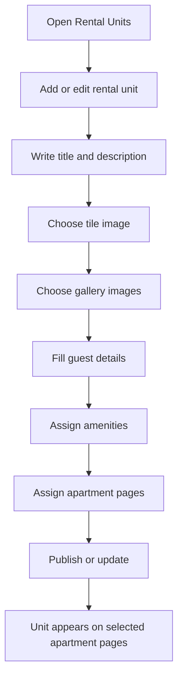

## 6. Manage Amenities

Amenities are reusable feature labels with optional icons.

Open **MultiRent Setup > Amenities**.

Use amenities for features guests scan quickly.

Good amenity names are short:

```text
Sea view
Parking
Kitchen
Balcony
Air conditioning
Wi-Fi
```

Avoid long sentences. Put longer explanations in the apartment description.

After creating amenities, edit a Rental Unit and check the amenities that apply.

**Process diagram:** amenity creation and assignment to rental units.

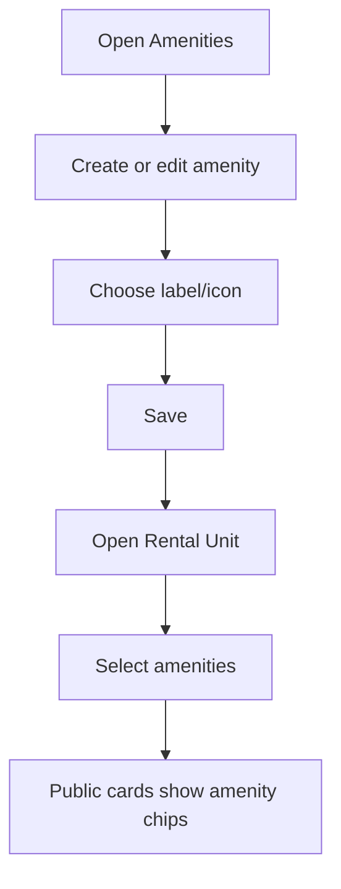

## 7. Create Contact Page Or Pages

Contact pages are managed from **MultiRent Setup > Pages & Buttons > Contact Pages**.

You can configure up to three Contact pages.

### Enable This Contact Page

Makes the contact page slot available publicly.

### Show In Top Menu

Adds the selected contact page to the generated/header menu.

### WordPress Page

Choose the WordPress page this contact slot controls.

### Contact Template

Choose the visual layout:

- **Contact / Booking Inquiry**: balanced details, inquiry, map, content, and form.
- **Contact - Split Map**: map-first layout.
- **Contact - Compact**: simpler single-column layout.

### Basic

- **Title**: main heading at the top of this contact page.
- **Intro**: short paragraph below the heading.

### Contact Details

- **Address**: one address line per line.
- **Phone**: primary phone.
- **Mobile**: mobile phone.
- **Email**: public email.

Empty fields are hidden.

### Map And QR

- **Map query**: text used to generate the embedded Google map.
- **Map note**: note under the map.
- **QR code image**: optional QR tile.

### Form And Booking Help

- **Form shortcode**: shortcode from a contact form plugin.
- **Booking help lines**: one requested guest detail per line.

Example:

```text
Preferred arrival and departure dates
Number of adults and children
Preferred apartment or flexible choice
Parking or arrival questions
```

### Visibility

Checkboxes decide which contact page sections appear:

- Details
- Booking help
- Map
- Page content
- Form
- Map note

**Process diagram:** contact page setup, sections, map, QR, and form shortcode.

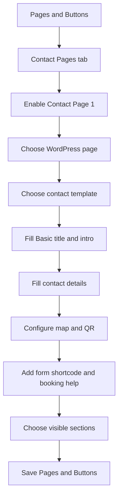

## 8. Create Local Page

The Local page explains nearby beaches, transport, restaurants, services, attractions, and practical arrival information.

Open **MultiRent Setup > Local Page**.

### Show Local Page

Publishes or drafts the selected Local page.

### Assigned Local Page

Choose the WordPress page used for local information.

### Local Template

Choose the layout:

- **Local Information**: full guide layout with useful links sidebar.
- **Local - Compact Guide**: stacked single-column layout.
- **Local - Featured Guide**: guide-first layout.

### Local Guide Lines

One line per guide card:

```text
Title | Description
```

Example:

```text
Beaches nearby | Describe the closest beach, walking time, shade, and family suitability.
How to arrive | Add airport, road, bus, ferry, parking, or check-in route notes.
```

### Local Highlights

Useful quick facts:

```text
Beach | 200 m from the property
Market | 5 minutes by car
Restaurant | Walking distance
```

### Local Activities

Ideas for guests:

```text
Day trips | Nearby towns, islands, parks, or scenic routes.
Outdoor activities | Hiking, cycling, swimming, courts, rentals, or tours.
Family ideas | Child-friendly places, playgrounds, or rainy-day ideas.
```

### Useful Links

One per line:

```text
Label | URL
```

### Visibility

Show or hide local guide sections independently.

**Process diagram:** local page setup and local guide content flow.

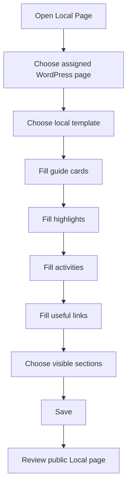

## 9. Create And Add Buttons

Homepage hero buttons are managed from **MultiRent Setup > Pages & Buttons > Hero Buttons**.

Each row represents an Apartment or Contact page slot.

For each button:

1. Check the row to show it under the homepage hero.
2. Enter the button label.
3. Choose the WordPress page the button opens.
4. Save.

Starter Content enables Apartment Page 1 and Contact Page 1 as the initial hero buttons.

The button destination is a page dropdown, not a raw URL field. This keeps setup easier for non-technical users.

**Process diagram:** homepage hero button setup using page dropdowns.

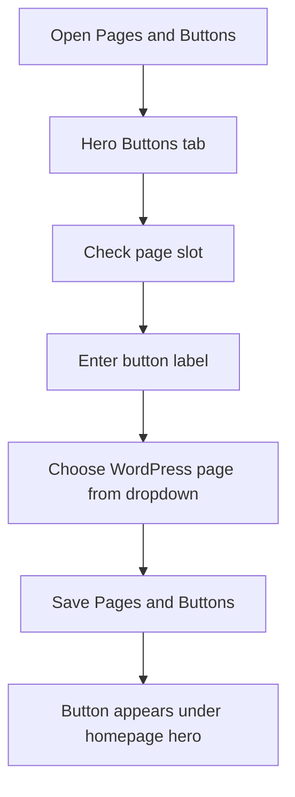

## 10. Manage The Top Menu

There are two ways to add menu items.

### Option A: Top Menu Builder

Open **MultiRent Setup > Website Setup > Top Menu Builder**.

One line per link:

```text
Label | URL
```

Example:

```text
Home | /
Apartments | /apartments/
Local | /local/
Contact | /contact/
```

Use this for manual custom links and order.

### Option B: Show In Top Menu

Open **MultiRent Setup > Pages & Buttons**.

For each Apartment or Contact page slot, check **Show in top menu**.

These automatic page-slot links are merged with Top Menu Builder links. Duplicate URLs are skipped.

**Process diagram:** top menu link sources and duplicate handling.

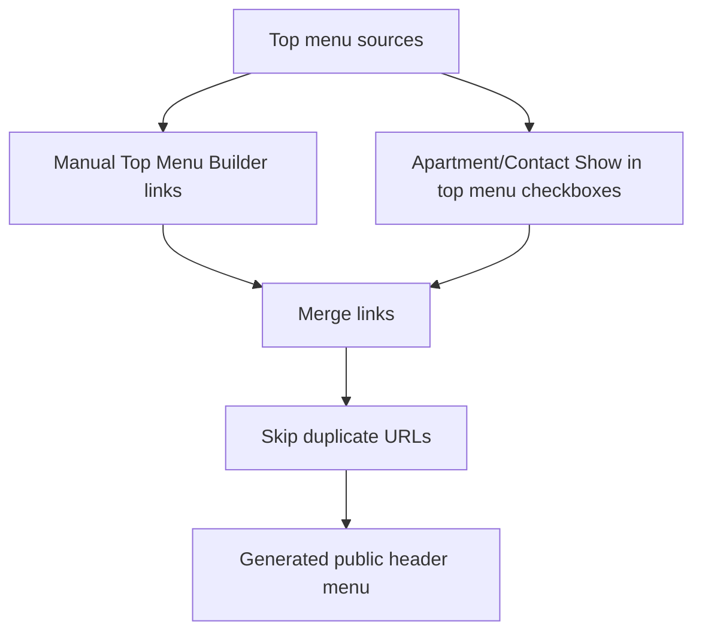

## 11. Style The Site

Open **MultiRent Setup > Website Setup**.

### Global Site Font

Choose one bundled font for public typography.

The font affects:

- body text
- headings
- menus
- cards
- buttons
- hero text

### Color Scheme

Choose a preset palette.

### Custom Colors

Enable custom colors if you need brand colors.

Custom color fields:

- Primary
- Dark
- Surface
- Accent

## 12. Test The Site

Review these pages:

- Home
- Apartments page(s)
- each rental unit detail page
- Contact page(s)
- Local page

Test at:

- desktop width
- tablet width
- mobile width

Check:

- menu opens on mobile
- hero buttons wrap/stack correctly
- apartment cards are readable
- maps and forms fit the page
- no empty sections appear
- hidden sections are really hidden

**Process diagram:** responsive review before backup and deployment.

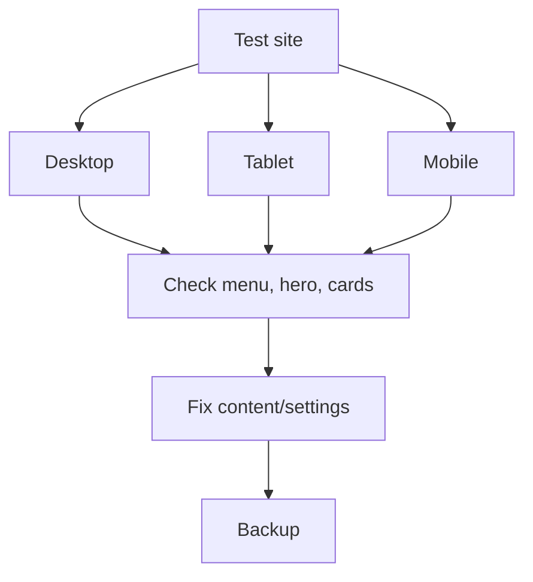

## 13. Backup Before Deployment

Before moving to a live site, create a full backup.

Recommended options:

- host/server backup
- All-in-One WP Migration export
- database export
- copy of theme/plugin ZIPs

Do not publish backup files or credentials to GitHub.

## 14. Deploy Or Upgrade Existing Site

For a normal WordPress upgrade:

1. Back up the live site.
2. Download the ZIP files from the [latest GitHub release](https://github.com/marinfrankovic/WP_MultiRent/releases/latest).
3. Upload the theme ZIP in **Appearance > Themes > Add New > Upload Theme**.
4. Upload the plugin ZIP in **Plugins > Add New > Upload Plugin**.
5. If WordPress asks to replace the existing theme/plugin, confirm replacement.
6. Open **MultiRent Setup**.
7. Review Website Setup, Pages & Buttons, Local Page, and Rental Units.
8. Save permalinks from **Settings > Permalinks** if rental URLs do not load.

For a full-site migration, use your backup/restore plugin and restore the complete WordPress site.

**Process diagram:** backup, upgrade, full migration, and live-site testing.

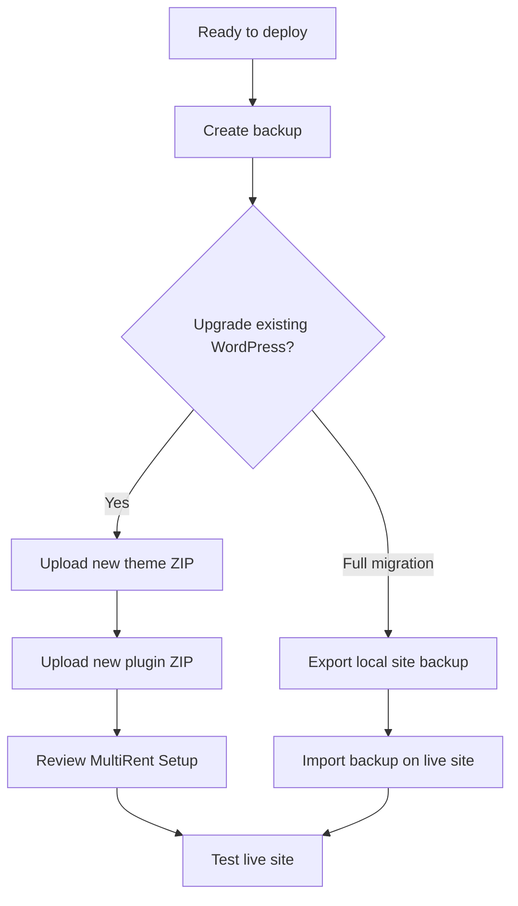

## Quick Checklist

- Theme and plugin installed
- Starter Content created
- Property name/tagline/logo set
- Global font selected
- Hero title/text/image reviewed
- Apartment Page 1 configured
- Contact Page 1 configured
- Local page configured
- Rental units created
- Rental units assigned to apartment pages
- Amenities assigned
- Hero buttons use page dropdowns
- Top menu reviewed
- Mobile layout checked
- Backup created
- Live deployment tested
